## Motivation

### How psychologists explain why behavior starts, changes, and continues

::: notes
Open the class session by framing the topic clearly.

Say:
“Today is about how psychologists explain motivation.
Not as character. Not as morality. Not as ‘some people have it and some people do not.’
We are treating motivation as a process that helps explain behavior.”

Preview the session in plain language:
- what motivation is
- why the same behavior can come from different motives
- why rewards sometimes help and sometimes backfire
- why pressure and confidence matter
- how this gives us a better way to think about behavior in ourselves and others
:::

## Warm-up

Three students all turn in their work on time.

- One enjoys the class
- One is afraid of failing
- One keeps procrastinating, then panic-finishes

**Think:** 1 minute  
**Pair:** 2 minutes  
**Share:** 2 responses

**Question:**  
Are these the same kind of motivation?

::: notes
This is Segment 1 of the class session.

Do not define motivation yet.

The purpose is to create the central problem:
the same outward behavior can come from different motives.

When you bring the room back together, ask:
“What information would you want before deciding what is going on?”
:::

## Same behavior does not mean same motive

Turning work in on time does **not** automatically mean:

- interest
- confidence
- healthy motivation
- low stress
- strong ability

::: notes
Say:
“One reason psychology matters is that behavior is easy to judge and harder to explain.”

This is the opening break from flat labels such as:
- motivated
- lazy
- disciplined
- does not care

Those labels often hide the real causes of behavior.
:::

## Motivation is a process

Motivation is the process that:

- **energizes** behavior
- **directs** behavior
- **sustains** behavior

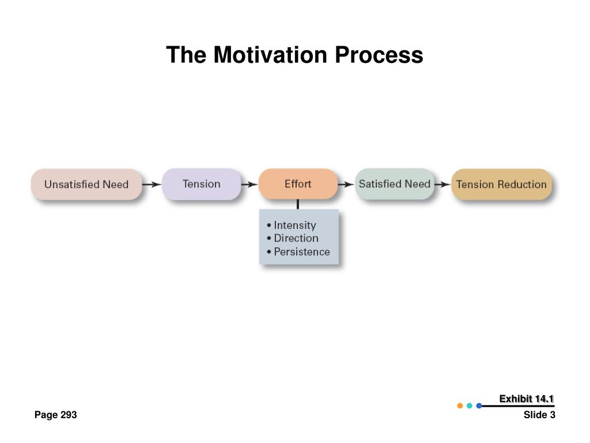{width=72%}

::: notes
This is the foundational definition for the whole class session.

Use one familiar example such as studying for an exam.

Energizes:
Does the student begin?

Directs:
What kind of studying do they choose?

Sustains:
Do they keep going when the task becomes difficult?
:::

## Motivation is not a trait

Motivation is not the same as:

- being a “motivated person”
- having stronger character
- caring more than everyone else
- having more willpower

::: notes
Say:
“This topic works better when we stop treating motivation like a fixed personal quality.”

Students can want something and still avoid it.
Students can act for reasons that are pressured or unsustainable.
Students can fail to act even when they care deeply.

This is one of the most important shifts in the topic.
:::

## Motivation is not the same as ability

A student may:

- understand the material but not start
- care about the outcome but still avoid the task
- want success but not believe success is possible

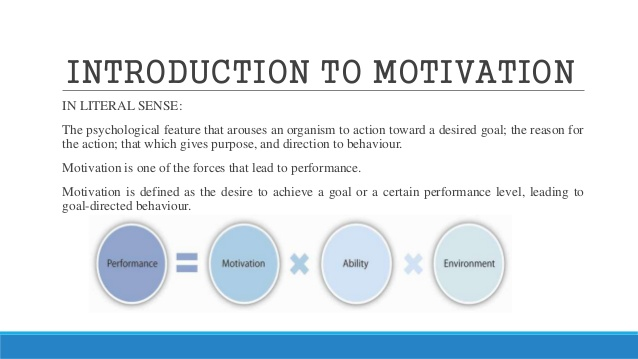{width=70%}

::: notes
Keep this distinction explicit.

Say:
“When people do not act, the problem is not always low ability and not always low care.
Sometimes the issue is motivation.
Sometimes it is confidence.
Sometimes it is pressure, structure, or context.”

Use the image only as a simple reminder that performance reflects more than one factor.
Do not let the formula become the point.
:::

## What is the barrier here?

A student avoids starting a paper because they think:

**“I am bad at this anyway.”**

What seems most central?

- low motivation
- low ability
- low confidence
- some combination

::: notes
This is a visible-thinking check inside Segment 2.

Guide the discussion toward:
low confidence is the strongest immediate barrier here, though more than one factor may be involved.

Tell students:
“We are going to come back to this when we talk about self-efficacy.”
:::

## One behavior can have many causes

Studying for an exam might be driven by:

- interest
- fear
- grades
- habit
- confidence
- pressure
- future goals

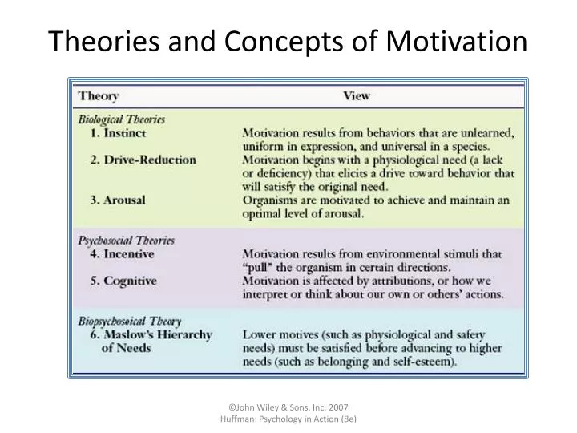{width=72%}

::: notes
Say:
“The same outward behavior can come from different combinations of motives.”

This is one of the most important Topic 17 ideas.

Students should leave this slide understanding that one behavior does not prove one cause.
:::

## A better question

Instead of asking:

**“Is this person motivated?”**

Ask:

**“What is driving this behavior?”**

::: notes
Pause here.

This is the student-facing throughline of the class session.

You are training students to ask better explanatory questions, not just collect terms.
:::

## Internal states and external incentives

Behavior can be shaped by:

- **internal states**
- **external incentives**

Many behaviors involve both.

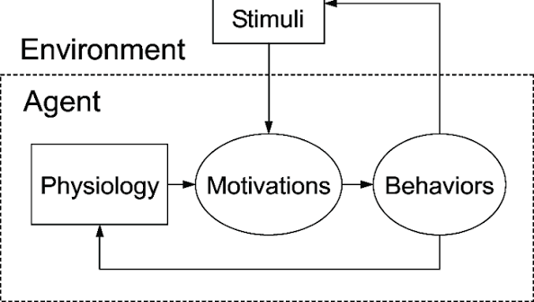{width=72%}

::: notes
This begins Segment 3.

Internal states include:
- need
- tension
- imbalance
- urge

External incentives include:
- reward
- consequence
- cue
- opportunity

Tell students this comparison explains a large share of everyday motivated behavior.
:::

## One useful chain

### Need → Drive → Response → Goal

- **Need:** something is out of balance
- **Drive:** internal push
- **Response:** behavior
- **Goal:** reduce the need or satisfy the value

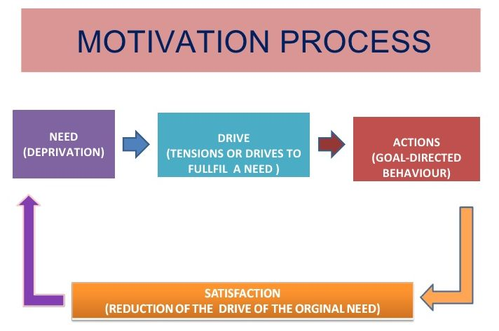{width=72%}

::: notes
Teach this as a useful explanatory sequence, not as dead vocabulary.

Use hunger as the clearest example:
- need: the body needs energy
- drive: hunger
- response: eating
- goal: restoring balance

Emphasize that this is one useful explanation, not the only one.
:::

## Drive theory and homeostasis

Drive theory helps explain how internal imbalance can push behavior.

Homeostasis refers to the body’s tendency to maintain internal balance.

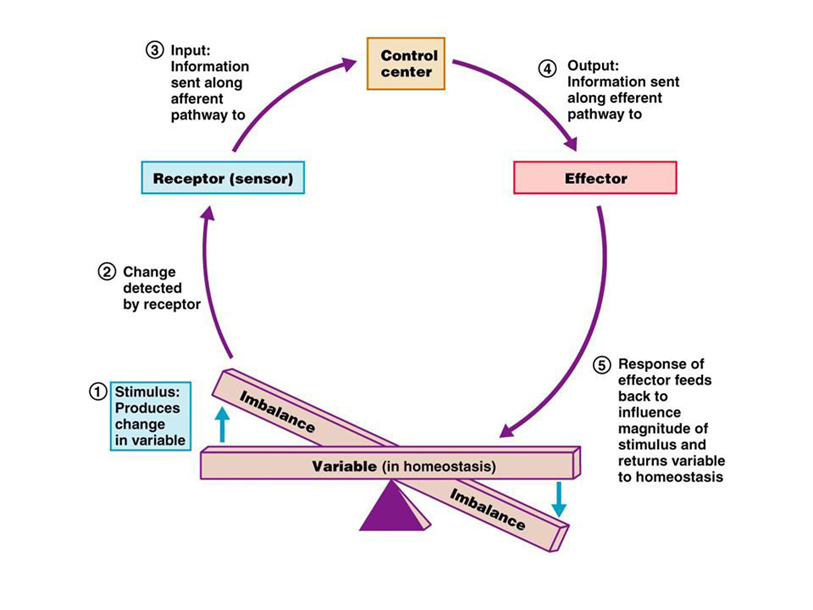{width=72%}

::: notes
Keep this brief.

Students do not need a physiology lecture.
They need just enough to understand why some motives feel regulatory and body-based.
:::

## Hunger as a biological example

Hunger shows that motivation can be shaped by:

- body signals
- internal balance
- cues in the environment
- learning and habits

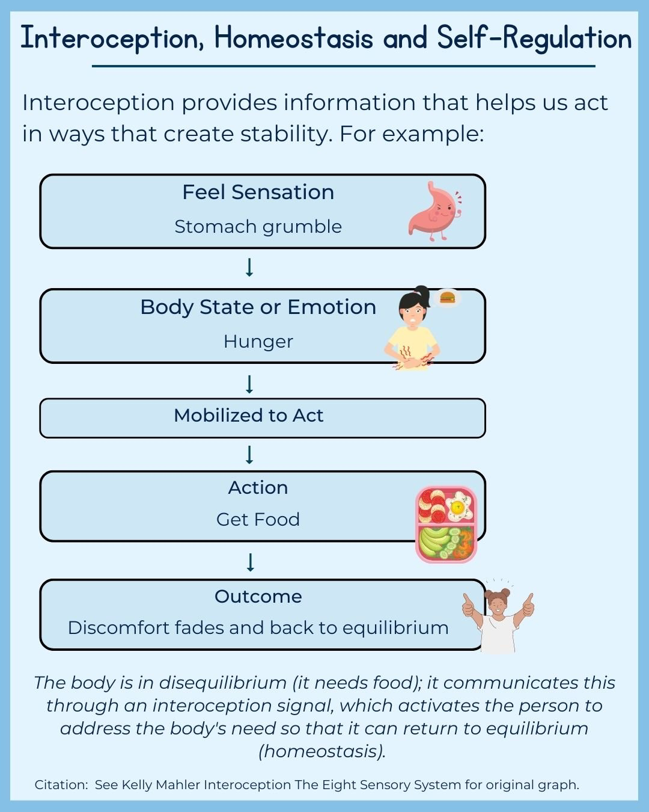{width=72%}

::: notes
Keep hunger as the main biological anchor for Topic 17.

Important boundary:
do not let this turn into a separate lesson on weight, obesity, or eating disorders.

Say:
“Even a biologically grounded motive is still shaped by context.”
:::

## What is shaping this behavior?

You already ate.

Then someone opens hot fries near you.

Now you want some.

What seems to be shaping the behavior?

- internal state
- external cue
- both

::: notes
This is the visible-thinking check for Segment 3.

Guide students toward:
many behaviors are shaped by both internal states and external cues.

This reinforces the idea that one-cause explanations are usually too weak.
:::

## Intrinsic motivation

Intrinsic motivation means the activity itself matters.

Examples:

- interest
- enjoyment
- challenge
- personal meaning

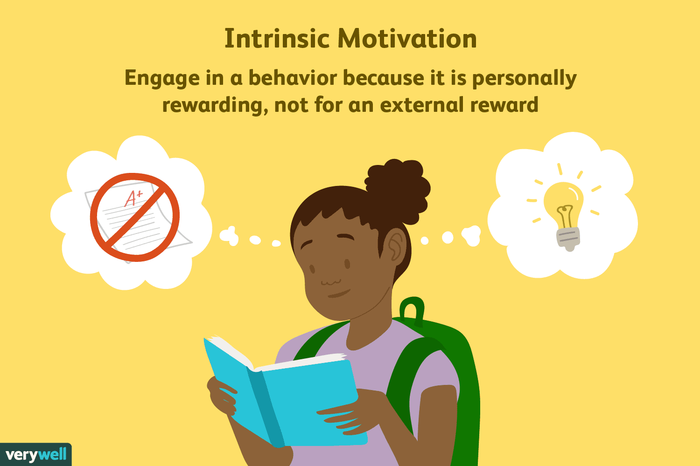{width=68%}

::: notes
This begins Segment 4.

Transition clearly:
“So far we have looked at internal states and incentives.
Now let’s look at a second comparison that matters a lot in school and life.”

Keep intrinsic simple and concrete.
:::

## Extrinsic motivation

Extrinsic motivation means the activity is a way to get something else.

Examples:

- grades
- money
- approval
- avoiding punishment
- getting it over with

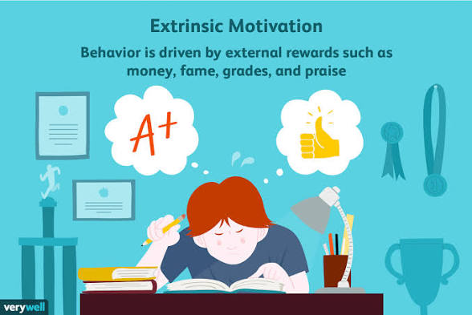{width=68%}

::: notes
Clarify that extrinsic motivation is not automatically bad.

The more accurate point is:
intrinsic and extrinsic motivation work differently, and the effects depend on context.
:::

## Not all rewards work the same way

Rewards can:

- support action
- do very little
- backfire

What matters is **what kind of motivation they create or replace**.

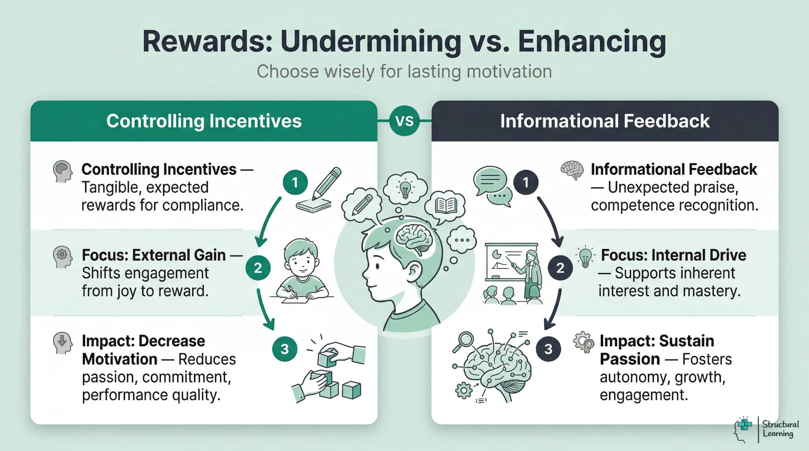{width=80%}

::: notes
Set up overjustification.

Say:
“The important question is not only whether behavior increases.
It is also whether the reason for acting changes.”
:::

## Overjustification

A reward can shift behavior from:

**“I do this because I value or enjoy it”**

to

**“I do this because I get something for it”**

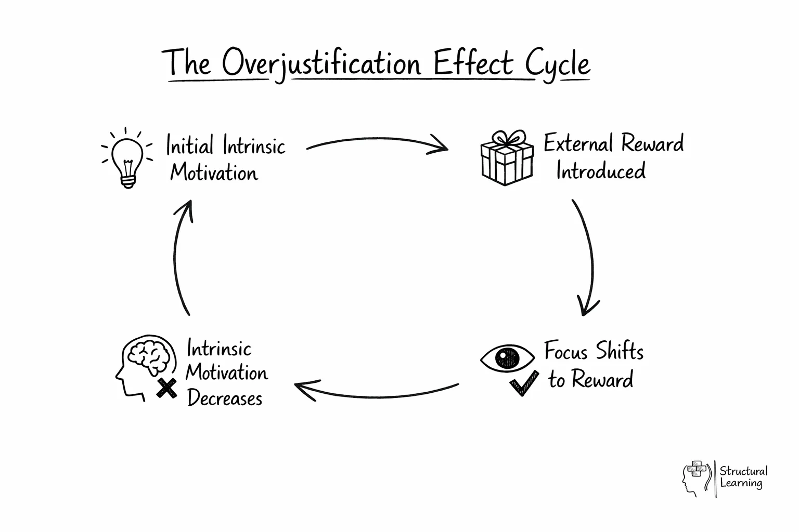{width=70%}

::: notes
Use familiar examples:
- reading for points
- drawing for payment
- doing a puzzle for a prize after already loving puzzles

Emphasize:
the behavior may continue, but the meaning of the behavior can change.
:::

## Reward cases

Would the reward likely:

- support action
- have little effect
- weaken interest

Examples:

- paying for a hobby someone already loves
- encouraging practice on a hard skill
- offering a small reward to start an unpleasant task

::: notes
This is the visible-thinking task for Segment 4.

Let students respond individually or with a partner.

Insist on justification.

The goal is not a cartoon rule like “rewards are bad.”
The goal is to think more precisely about what rewards do.
:::

## Instinct theory

- **Instinct theory** explains some behavior as:
  - inborn
  - unlearned
  - species-typical
- Best fit:
  - simple biological patterns
- Limited fit:
  - complex human behavior shaped by learning and culture

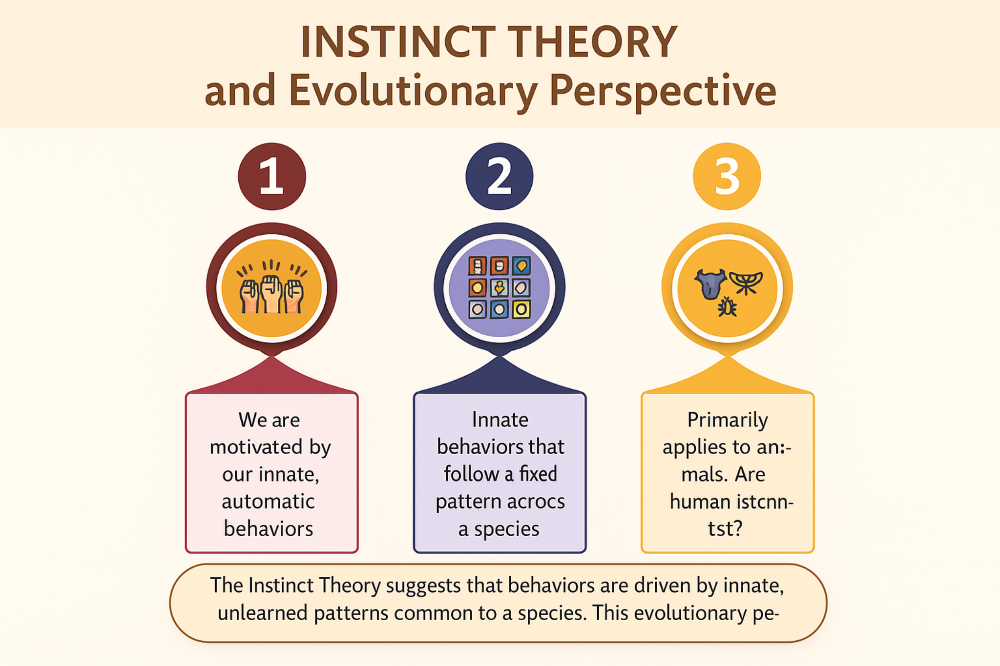{width=72%}

::: notes
Keep this brief.

Say:
“Instinct theory matters historically because it tried to explain behavior through inherited patterns.”

Then immediately compare it to what came before:
- drive theory explains regulation of imbalance
- instinct theory explains inherited patterns
- they are not the same thing

Do not let this become a long history-of-psychology detour.
:::

## Pressure can help or hurt

More activation is not always better.

Sometimes pressure helps.  
Sometimes pressure interferes.

::: notes
This begins Segment 5.

Transition:
“Now let’s look at something students experience all the time: pressure.”

Keep the connection to lived experience strong.
:::

## Arousal and performance

In general:

- too little arousal can lower focus
- too much arousal can disrupt performance
- the most effective level depends on the task

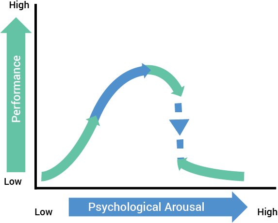{width=72%}

::: notes
Teach arousal theory and the Yerkes-Dodson idea in usable language.

Do not make the graph the point.
The point is task fit.
:::

## Task demands matter

Higher activation may help with:

- simple tasks
- familiar tasks
- repetitive tasks

Lower or moderate activation may help with:

- difficult tasks
- complex tasks
- unfamiliar tasks

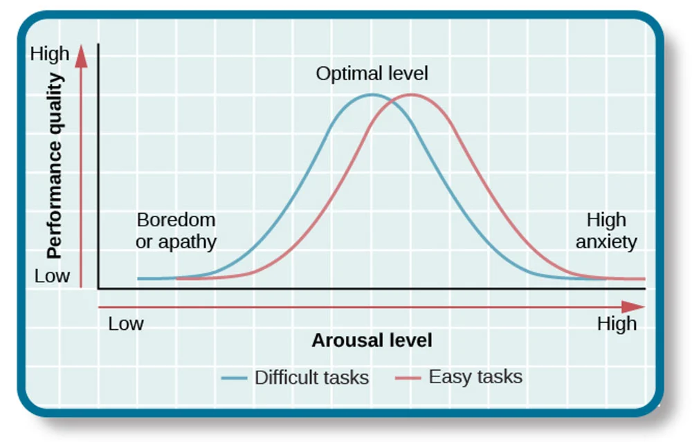{width=74%}

::: notes
Use examples students know:
- routine chores
- a difficult exam
- a speech
- a new math problem
- a familiar athletic drill

Say:
“The question is not ‘Is pressure good or bad?’
The question is ‘Pressure for what kind of task?’”
:::

## Which task is more likely to suffer under very high pressure?

- folding laundry
- solving a hard exam problem
- both
- depends on the person

::: notes
This is the visible-thinking check for Segment 5.

Guide students toward:
the more complex cognitive task is more likely to suffer under very high pressure.

Reinforce:
more fired up is not the same as better prepared to perform well.
:::

## Wanting something is not always enough

People sometimes care deeply  
and still do not act.

Why?

::: notes
This begins Segment 6.

Pause before defining self-efficacy.

Let the question sit for a moment.
This is one of the most personally relevant turning points in the class session.
:::

## Self-efficacy

Self-efficacy is a person’s belief that they can do what the task requires.

It answers:

**“Can I do this?”**

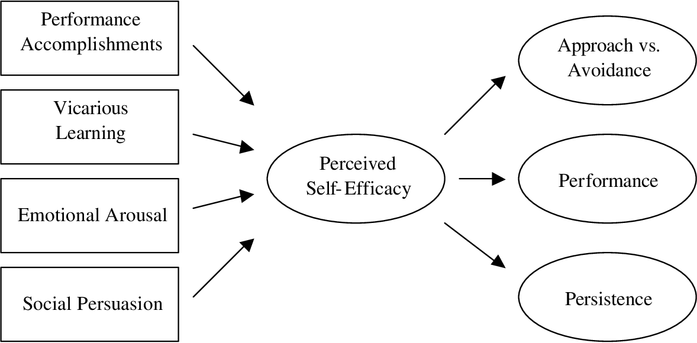{width=74%}

::: notes
Teach this carefully.

Say:
“This is not just about liking yourself.
It is a task-focused belief about capability.”

Keep it tied to action:
- do I start
- do I keep going
- do I return after difficulty
:::

## Self-efficacy is not self-esteem

- **Self-efficacy:** belief about capability for a task
- **Self-esteem:** broader evaluation of self

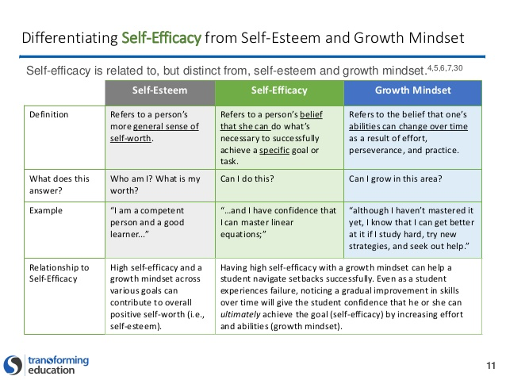{width=76%}

::: notes
Give a concrete example:

Low self-efficacy:
“I do not think I can write this paper.”

Higher self-efficacy:
“I can do this if I break it into smaller steps.”

Explain why this matters:
belief about capability changes whether people begin, persist, and return after setbacks.
:::

## Social motives

People are also motivated by social goals such as:

- **achievement**
  - success, accomplishment, mastery
- **affiliation**
  - belonging, acceptance, connection
- **intimacy**
  - close, warm, meaningful relationships

::: notes
Keep this slide text-only.

Say:
“The same behavior can be driven by different social motives.
A student who joins a club may want recognition, belonging, or closeness.
Those are not the same motive.”

Do not center McClelland here.
The course-facing trio is:
- achievement
- affiliation
- intimacy
:::

## Maslow as a broad framework

Maslow offers a broad way to organize needs:

- physiological
- safety
- belonging
- esteem
- self-actualization

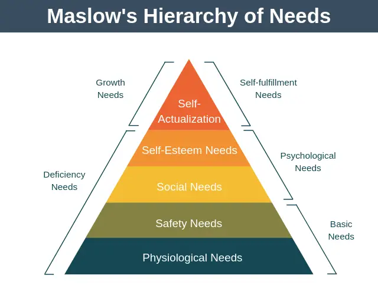{width=74%}

::: notes
This begins Segment 7.

Keep Maslow brief and controlled.

Maslow belongs here as a broad organizing framework, not as the whole lesson.
:::

## Maslow is useful, not a rulebook

Maslow is useful for:

- organizing kinds of needs
- seeing motivation as broader than reward and punishment
- recognizing the importance of belonging and esteem

Maslow is **not**:

- a rigid staircase
- a complete theory of behavior

::: notes
Tie this back to student life:
belonging, safety, and esteem can all affect school motivation.

Keep the treatment honest and bounded.
:::

## Praise, mindset, and motivation

The kind of feedback people receive can shape motivation.

- **Ability-focused praise**
  - can make success feel tied to fixed talent
- **Effort / strategy-focused praise**
  - can make challenge feel more workable
- Feedback teaches people what success means:
  - talent
  - effort
  - strategy
  - persistence

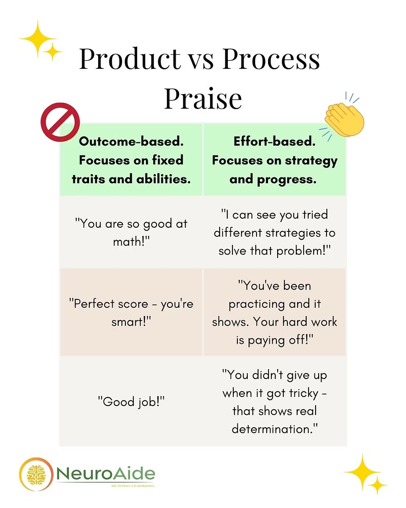{width=72%}

::: notes
Say:
“The key issue is not whether praise exists.
The key issue is what the praise teaches the person to believe about success.”

Make the bridge to self-efficacy explicit:
if feedback changes what a student believes about how success works,
it can also change whether they think they can improve.

Translate the image for students:
- product praise points to fixed traits or outcomes
- process praise points to strategy, persistence, and learning
:::

## What looks like low motivation?

What may look like low motivation may actually be:

- low confidence
- overload
- unclear next step
- fear of failure
- poor reward structure
- too much pressure

::: notes
This is one of the strongest lifelong-learning slides in the deck.

Say:
“A better explanation often leads to a better response.”

This is where the topic becomes useful, humane, and psychologically realistic.
:::

## What seems most relevant?

Think of a task you avoided recently.

What seems most relevant?

- low interest
- weak reward
- too much pressure
- low confidence
- unclear next step
- some combination

::: notes
This is the visible-thinking task for Segment 6.

Keep this reflective rather than confessional.

Students can think silently, jot a few words, or answer privately.
If you discuss it, surface patterns rather than personal details.
:::

## Closing synthesis

Instead of saying:

- “They are lazy”
- “They just do not care”
- “They are motivated”

Ask:

- What need is operating?
- What incentive is present?
- Is arousal helping or hurting?
- Does the person believe they can succeed?
- What is the context doing?

::: notes
This begins Segment 8.

Return to the opening students and re-explain their behavior using the full framework from the class session.

This is the closing loop:
students should now have a better way to interpret the same behavior.
:::

## Final written response

Complete this sentence:

**One idea from today that changes how I think about behavior is...**

::: notes
This makes the transfer task visible to students instead of hiding it only in notes.

Give them a short silent writing moment.

This can also function as a closing check on whether the main shift in thinking actually happened.
:::

## Final takeaway

Motivation is not a fixed trait.

It is a changeable process shaped by:

- needs
- incentives
- arousal
- beliefs about capability
- context

::: notes
End slowly and clearly.

This is the lasting takeaway for Topic 17.
:::